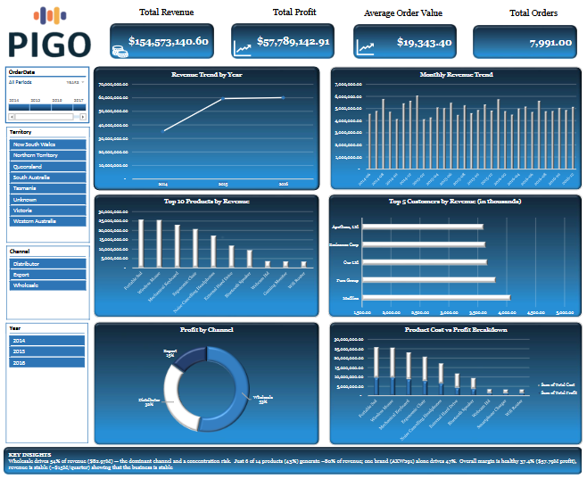
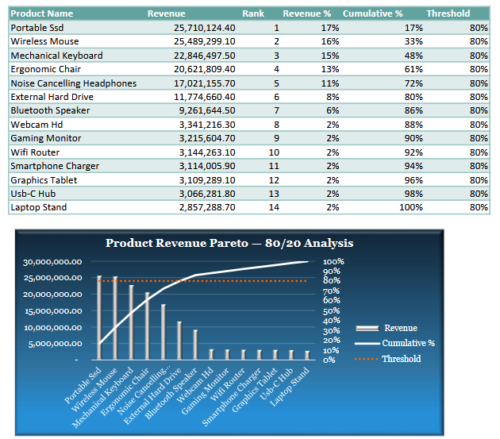
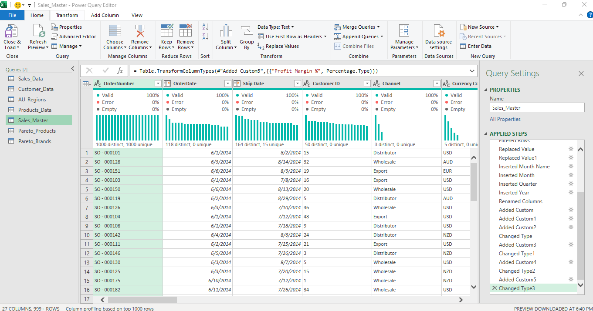

# Retail Performance Intelligence & Business Analytics System

An automated, Excel-based business-intelligence solution that turns raw, dirty retail transaction data into an interactive executive dashboard. Built end to end with Power Query ETL, a merged analytical data model, Pareto and trend analytics, and a one-page decision dashboard engineered so new data flows through to every metric and chart with a single refresh, no manual rework.

---

## Project description

Retail Performance Intelligence is an end-to-end, automated business-intelligence solution built in Excel and Power Query. It transforms four raw, unclean source tables, sales orders, customers, regions and products, into a single governed data model that powers an interactive executive dashboard.

The design goal was automation and scale, not a static report. Every transformation is built into the Power Query pipeline, so the entire system updates from source to dashboard with one refresh and no manual editing, which means the same solution keeps working as data volumes grow. On top of the cleaned model it answers the questions management actually asks: where revenue comes from, which products and brands drive most of it, and how performance is trending. A reflection layer documents the data-quality issues resolved, the assumptions made, and three executive recommendations, so the output is auditable, not just presentable.

---

## The business problem

Management didn't want another static report. The brief was to build a scalable analytics system that monitors performance, surfaces growth opportunities, flags underperforming products, and supports executive decisions, all from messy source data that must never be edited by hand. Every transformation therefore lives in Power Query, so the whole model updates from new data with a single refresh.

---

## What's inside

The solution ingests four raw tables (Sales Orders, Customers, AU Regions, Products), cleans and merges them into a single analytical model, and drives every downstream sheet from that model.

- **ETL (Power Query):** text standardisation, whitespace trimming, duplicate removal, category validation, and date-intelligence fields (Month Name, Month-Year, Quarter) derived from the order date.
- **Data model:** the four tables merged into one `Sales_Master` table on their key fields, with a calculated `Total Revenue = Order Quantity x Unit Price`.
- **Business metrics:** Total Revenue, Total Orders, Average Order Value, plus revenue split by channel, city and customer.
- **Pareto (80/20) analysis:** at both product and brand level, with rank, revenue %, and cumulative % against an 80% threshold.
- **Trend analysis:** monthly revenue, best and worst months, and quarter-over-quarter growth.
- **Executive dashboard:** KPI cards, a yearly revenue trend line, Top 10 products, Top 5 customers, and monthly revenue, all wired to slicers and a timeline filter.
- **Project Reflection:** business-logic defence, a troubleshooting journal, stated assumptions, and three executive recommendations.

---

## Headline results

Analysis of **7,991 transactions** across 2014-2016.

| KPI | Value |
|---|---|
| Total Revenue | **$154.6M** (nominal, mixed-currency, see limitations) |
| Gross Profit | **$57.8M** (37.4% margin) |
| Total Orders | ~7,991 |
| Channel mix | Wholesale **53.7%**, Distributor **31.7%**, Export **14.6%** |

**Pareto, products:** 6 of 14 products (43%) generate roughly **80% of revenue**, led by the Portable SSD (16.6%) and Wireless Mouse. The bottom 8 products together contribute only about 20%.

**Pareto, brands:** revenue is even more concentrated. A single brand proxy, `AXW291`, drives **47%** of revenue, and the top two reach **71%**, which is a real single-supplier dependency risk.

**Trend:** revenue is broadly stable month to month, peaking around January 2015 (~$6.1M), with quarter-over-quarter growth tracked across the full 2014-2016 window.

---

## Executive recommendations

1. **Diversify the channel mix.** Wholesale drives 53.7% of revenue; grow the Export channel (14.6%) by ~5 points to reduce single-channel concentration risk while protecting key wholesale accounts.
2. **Rationalise the long tail.** The bottom 8 of 14 products add only ~20% of revenue. Review them for repricing, bundling or discontinuation, and reinvest into the top 6 that drive 80%.
3. **Shift from revenue to margin.** Build a margin-ranked view alongside the revenue ranking to find high-revenue, low-margin SKUs, and renegotiate supplier terms on `AXW291`, where 47% of revenue means the largest absolute margin upside.

---

## Engineering worth calling out

Two data-quality issues were caught and handled rather than hidden, which is the part of the project I'm most proud of.

- **Silent row collapse.** During cleaning, the dataset quietly dropped from 7,991 rows to ~199 because a stray `Filtered Rows` step in Power Query retained only Q4 records, with no error message. I caught it with a **row-count validation check** after each transformation, traced it to the offending Applied Step, and removed it. That habit then caught a second recurrence.
- **Referential-integrity gap.** 55 orders referenced `Region ID 86`, which had no match in the regions table. Instead of dropping the rows and losing real revenue, I used a **left outer join** and tagged the gap as `Unknown`, preserving 100% of revenue while flagging the issue transparently.

---

## Skills demonstrated

`Power Query (M)` - `ETL & data cleaning` - `data modelling / table merges` - `date intelligence` - `Pareto / ABC analysis` - `trend & QoQ analysis` - `PivotTables & charts` - `interactive dashboard design (slicers, timeline)` - `data storytelling` - `data-quality validation` - `assumption disclosure`

---

## How to use

1. Open `Retail_Performance_Intelligence_Moses_Okunlola.xlsx` in Microsoft Excel (Windows, with Power Query).
2. Explore the **Dashboard** sheet, use the slicers and timeline to filter by period, channel, and region.
3. **To test the automated refresh:** point the source query at `New_Data_Stress_Test.xlsx` (or add rows to the raw tables) and click **Data -> Refresh All**. Every metric, chart and Pareto table updates with no manual edits.

---

## Assumptions & limitations

- **Currency:** the source mixed five currencies (USD, EUR, GBP, AUD, NZD) with no exchange-rate table. All figures are reported as a single nominal unit with no FX conversion applied. The headline totals ($154.6M revenue, $57.8M profit) are mixed-currency nominal values, not true AUD. This is a deliberate, disclosed simplification.
- **Brand proxy:** the data has no explicit brand field, so `Warehouse Code` is used as a brand/supplier proxy. In production, a product-master table with a true brand attribute would replace it.

---

## Author

**Moses Okunlola** - transitioning into data analytics, with a background in compensation, benefits and business intelligence.
LinkedIn: _add your post/profile URL_ - Contact: _add email_
